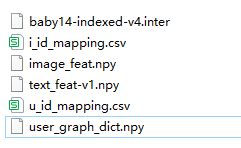

# dragon 算法使用说明

## 环境安装

### 创建yaml配置
创建yaml配置，包括name、channels和dependencies, 其含义如下：
- name: 环境的名称，等价于 conda create -n {name}
- channels: 配置依赖源的地址，比如配置清华的软件源：https://mirrors.tuna.tsinghua.edu.cn/anaconda/pkgs/free/， 默认是defaults
- dependencies: 该换将下需要安装的软件包及对应的版本， 这里是使用conda安装的
- pip: pip安装的软件包， 

对于dragon的环境，见../dragon.yml
安装方法：
    
    conda env create -f dragon.yaml

### pip通过文件安装
dragon.yml是通用的环境，可进一步使用pip安装
    
    pip install -r requirements.txt
有时候会因为requirements.txt中部分软件包安装不成功，可以手动补充确实的包

### pip手动补充安装
有时候pip安装部分软件会安装使用，可以手动安装，尤其是跟torch配套的部分， 这里一定要指定版本，否则会出错

    pip install torch==1.11.0
    pip install torch-cluster==1.6.0
    pip install torch-geometric==2.2.0
    pip install torch-scatter==2.0.9
    pip install torch-sparse==0.6.14
    pip install torch-spline-conv==1.2.1
    pip install torchaudio==0.11.0
    pip install torchvision==0.12.0
    pip install transformers==4.17.0

## 数据准备
### 实验数据下载
从谷歌云盘下载或其他途径下载baby数据（其他数据同理）。baby的数据包含文件：

### 实验数据对应的配置
在configs/dataset/baby.yaml需要对应的路径,确保与下载的实验数据名称一致
- inter_file_name: 'baby14-indexed-v4.inter'
- vision_feature_file: 'image_feat.npy'
- text_feature_file: 'text_feat-v1.npy'
- user_graph_dict_file: 'user_graph_dict.npy'

## 实验超参修改
在configs/model/DRAGON.yaml中配置了实验超参，可以根据需要修改， 具体看文件配置，这里不展开介绍

## 运行dragon或基于dragon开发的算法

    # 切换环境
    cd onerec_v2\DRAGON
    conda activate {name} # dragon.yml中的name
    python mian.py

# QA
Q: 运行提示tensor类型不对

A: utils/metrics.py 中np.float 改成np.float64

Q: self.result_embed = torch.cat((user_rep, item_rep), dim=0)报错
A：改成self.result_embed = nn.Parameter(torch.cat((user_rep, item_rep), dim=0))，  位置为：models/dragon.py