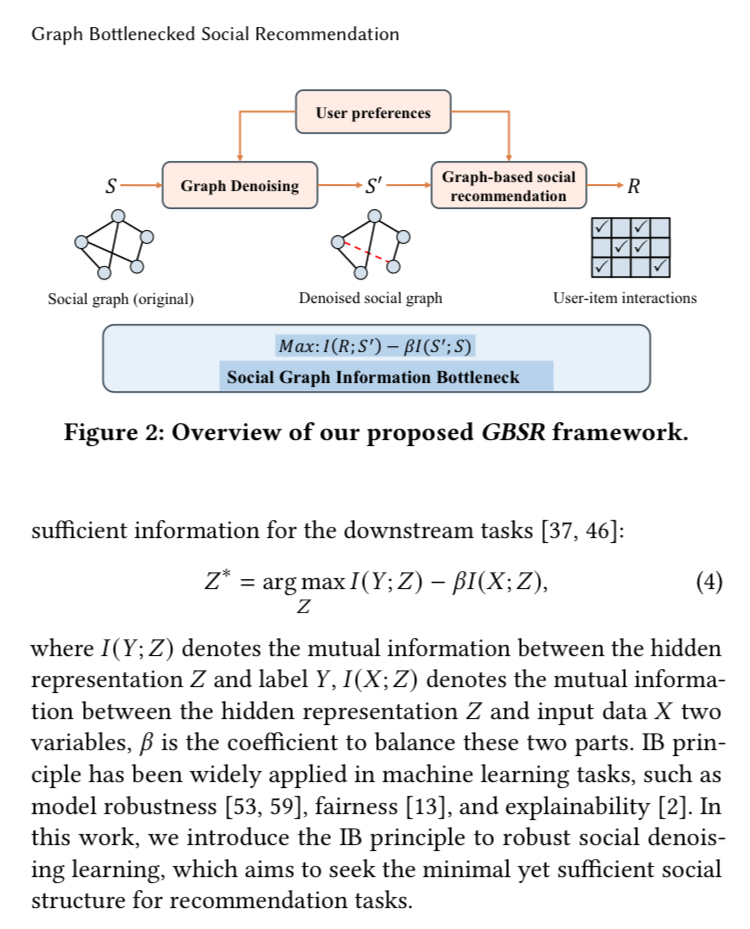

1 如何提取一个中间层表征，使得对下游任务友好，又对原始任务去噪声？   
1.1 信息瓶颈理论  

公式中，Z表示中间层表征，X表示上有任务的原始数据，Y表示下游任务;I表示互信息，可以用理论上更好但效果无法保证的HSIC方法代替(Hilbert-Schmidt independence criterion)
https://arxiv.org/pdf/1503.02406  
https://arxiv.org/pdf/2406.08214  

